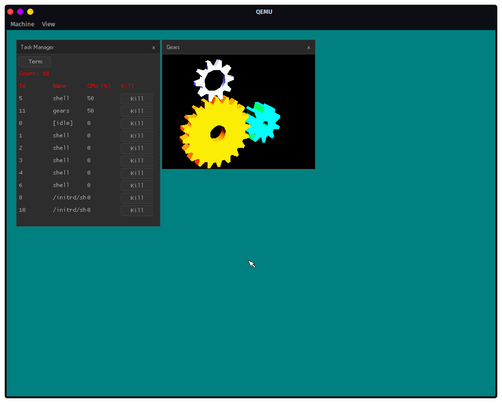

## About
Asterisk is an operating system written in C. It uses some code from the discontinued project [soso](https://github.com/ozkl/soso), and currently only supports `i386+` processors.
## Building
Now you can build asterisk's kernel by running `make kernel`. You will need a cross-compiler for this though, and luckily asterisk comes with a script that can build you a cross-compiler for building asterisk. See [this](docs/kernel/TOOLCHAIN.md) page before building the kernel.
Running `make all` or simply `make` will build the kernel, and a CD-ROM image that can be used to test with QEMU. If you build the CD-ROM, it will copy a file called `initrd.fat` (which I took from [soso](https://github.com/ozkl/soso) and can't be built right now).
## Testing
After building the kernel and making the CD-ROM image, you can test asterisk:
```
make test
```
## Screenshot

*Asterisk running with [soso](https://github.com/ozkl/soso)'s initrd!*
## Contributors
When I took code from [soso](https://github.com/ozkl/soso), I also took some code from the pull requests that fixed different aspects of the kernel. Although they may not show up in the GitHub repository's contributor list, I will still add them here:
* [Dashbloxx](https://github.com/Dashbloxx) for creating this project
* [rilysh](https://github.com/rilysh) [for this](https://github.com/ozkl/soso/pull/10)
* [sk-io](https://github.com/sk-io) [for this](https://github.com/ozkl/soso/pull/19)
## License
Asterisk is licensed under the BSD-2-Clause license.
